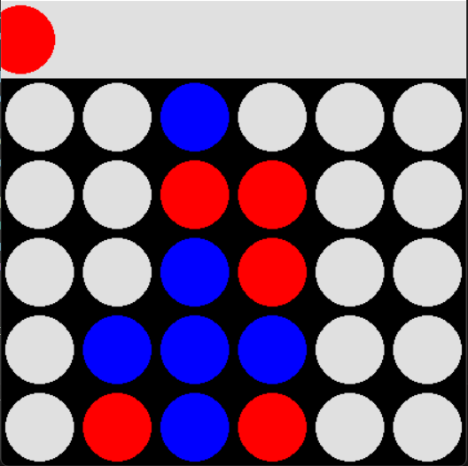

# Advanced-Connect-Four-AI-Project

An intelligent implementation of Connect Four featuring multiple game modes and an AI opponent using the Minimax algorithm with Alpha-Beta pruning.


## 📝 Table of Contents

- [Features](#-features)
- [Prerequisites](#-prerequisites)
- [Installation](#-installation)
- [Usage](#-usage)
- [Game Modes](#-game-modes)
- [Technical Implementation](#-technical-implementation)

## ✨ Features

- **Customizable Board Size**: Play on any M×N grid
- **Multiple Game Modes**:
  - Human vs Human
  - Human vs AI
  - AI vs AI
- **Smart AI**: Implements Minimax algorithm with Alpha-Beta pruning
- **GUI**: Graphical interface built with Pygame
- **Color-Coded**: Red and Blue pieces for easy gameplay

## 📋 Prerequisites

- Python 3.6 or higher
- NumPy
- Pygame

## 🚀 Installation

1. Clone the repository:
```bash
git clone https://github.com/yourusername/connect-four-ai.git
cd connect-four-ai
```

2. Install required packages:
```bash
pip install -r requirements.txt
```

## 💻 Usage

1. Start the game:
```bash
python connect_four.py
```

2. Follow the prompts:
```
Choose M and N Separated by Space:
> 6 7

Choose Game Mode:
 1- Human VS Human
 2- Human VS AI
 3- AI vs AI
> 
```

3. Controls:
- Move mouse over columns to select
- Click to drop piece
- Watch for win announcements
- Close window to exit
- 


## 🎮 Game Modes

### Human vs Human
- Two players take turns
- Red pieces for Player 1
- Blue pieces for Player 2

### Human vs AI
- Play against AI opponent
- Human plays as red pieces
- AI uses Minimax algorithm
- Depth 5 search tree

### AI vs AI
- Watch two AI players compete
- 500ms delay between moves
- Automated gameplay demonstration

## 🔧 Technical Implementation

### Core Components

1. **Board Management**
```python
def initialize_board():
    board = np.zeros((M, N))
    return board
```

2. **Move Validation**
```python
def is_valid_loc(board, col):
    return board[M-1][col] == 0
```

3. **Win Detection**
- Horizontal check
- Vertical check
- Diagonal checks (both directions)

### AI Strategy

The AI evaluates positions using:

- **Center Control**: Prioritizes center columns
- **Pattern Recognition**: Evaluates potential winning sequences
- **Blocking**: Prevents opponent wins
- **Look Ahead**: Uses Minimax with depth 5

### Scoring System

- Four in a row: 225 points
- Three in a row: 22 points
- Two in a row: 16 points
- Blocking opponent's three: -20 points


